# NYC Taxi Fare Prediction--Machine Learning Explainability

+ This project was conducted by Young Sim.

+ **Objectives**: The goal of this porject is to extract human-understandable insights from machine learning models by using techniques like permutation importance, partial dependence plots, and SHAP values. The following insights can be driven by using these methods:

    + What features in the were most important in the corresponding model?
    + How does each feature affect predictions in a big-picture sense?
    + For any single prediction from a model, how did each feature affect that particular prediction?
    
    These insights not only help human understanding of machine learning models but also help find directions for model improvements.

+ **Summary**: In this project, we will focus on model explainability techniques rather than building and optimizing the model. So here we just used a simple random forest model to keep it easy.
    + Permutation Importance: randomly re-ordering a single column should cause less accurate predictions, since the resulting data no longer corresponds to anything observed in the real world. Model accuracy especially suffers if we shuffle a column that the model relied on heavily for predictions. Thus, permutation importance gives us **what features have the biggest impact on predictions**, or **feature importance**.
    
      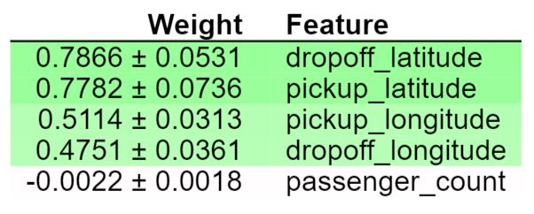

      The values towards the top are the most important features, and those towards the bottom matter least. The first number in each row shows how much model performance decreased with a random shuffling.

      In the example above, we can tell while pick up locations and drop off locations are all important features, passenger count does not have much importance in the model. Also, it seems that latitude have more importance than longitude:

      + It might be that travel might be longer in latitude distances than longitude distances in general. Given the shape of NYC which is vertically long, this assumption makes sense.
      + It could also be that tolls might be more expensive on vertical roads than horizontal roads.
      + Another possibility is that the pricing may vary by different parts of the city.

    + Partial Dependence Plots: while feature importance shows what variables most affect predictions, partial dependence plots show how a feature affects predictions. Partial dependence plots repeatedly alter the value for one variable to make a series of predictions and trace out predicted outcomes.
        
        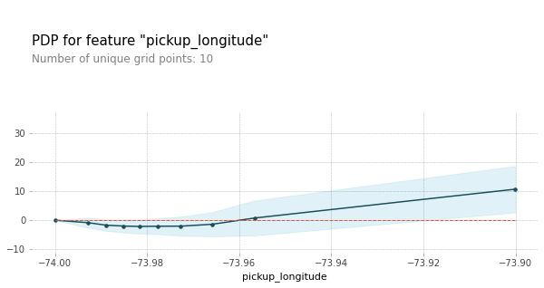 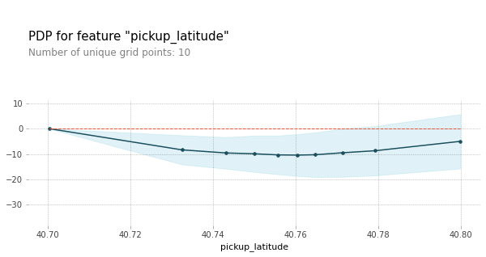
        
        We have a sense from the permutation importance results that **distance is the most important determinant of taxi fare**.
        This model didn't include distance measures (like absolute change in latitude or longitude) as features, so coordinate features (like pickup_longitude) capture the effect of distance. Being picked up near the center of the longitude values lowers predicted fares on average, because it means shorter trips (on average).

        For the same reason, we see the general U-shape in all our partial dependence plots for latitude/longitude.
        
        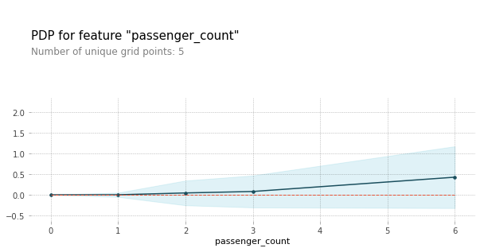
        
        We can also observe that the **number of passengers is positively related to the fare**. In the results from permutation importance, we saw that the number of passengers have very low feature importance:
        + Positive relationship between a feature and target does not necessarily indicate high permutation importance.
        + If the data for the feature does not vary much, shuffling would not make much change in the data. Thus permutation importance would be low.
        + We can observe from the graph for passenger count that up to 3 passengers, the fare does not increase very much, so if a majority of the data indicate number of passengers less than 4, it would not make much impact on the fare.
        + From the histogram below, we can see that the majority of the numer of passengers is 1.
        + Also, the slope of the relationship is gradual. Although there seems to be a positive relationship between the feature and the target, the impact can be small.
        
        
        
        
          
        In 2D partial dependent plots, diagonal contours are expected to be seen in the above plots because these are pairs of values where the pickup and dropoff longitudes/latitudes are nearby, indicating shorter trips (controlling for other factors). Prices are expected to increase as you get further from the central diagonal, as the distances between the pickup and dropoff longitudes/latitudes also increase.

        While we can see that trend in the above plots, we can also see that prices increase as you go further to the upper-right of the longitude graph, and as you go to the lower-left of the latitude graph.

        This could be worth further investigation, though the effect is small compared to moving away from the central diagonal line.

    + New Features: new features are created based on the results and insights above. The new features are longitude/latitude distances. Since we only have seven features includeing the new features here, we'll keep all features. When there are too many features and the computational expense is high or when we are working with models that are more likely to overfit, we can use the above technique and insights for feature selection.
    
    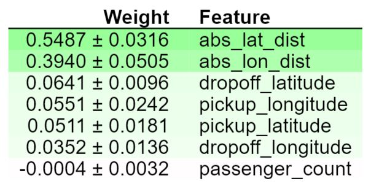
    
    While both features for distances had higher feature importances than location features, latitude distances are more important than longitude distances. This does not give us information on whether traveling a fixed latitudinal distance is more or less expensive than traveling the same longitudinal distance.

    Possible reasons latitude feature are more important than longitude features:

      + Latitudinal distances in the dataset tend to be larger
      + It is more expensive to travel a fixed latitudinal distance
      + Both of the above
      
    + Changes in Partial Dependence Plots
    
     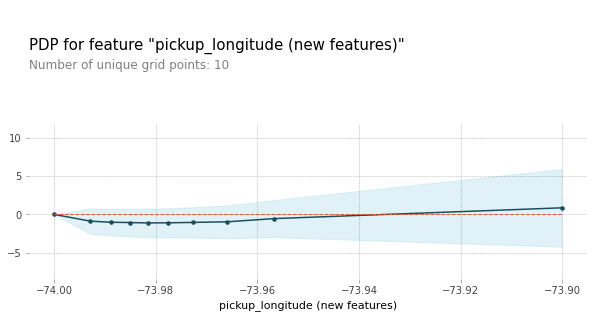
    
     
    
    From the graphs above, we can see that the slope of the partial dependence plot became much gradual. Once you control for absolute distance traveled, the pickup_longitude has only a very small impact on predictions.

    + PDP for New Features: The relationships are both positive. We can also see that the slope is steeper for latitude distance, which indicates it costs more to travel a fixed latitudinal distance than traveling the same longitudinal distance.
    
    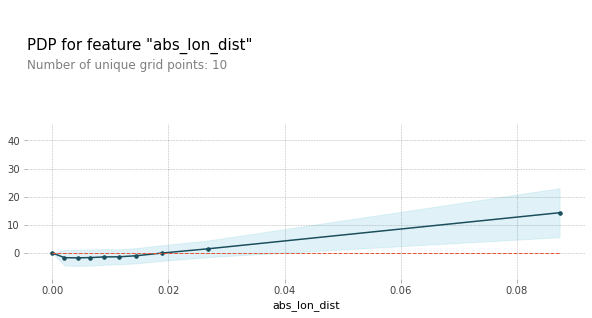 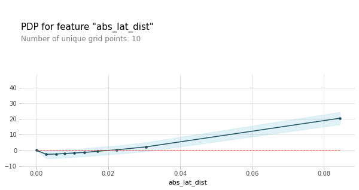
    
    + SHAP Values: We have extracted general insights from the model. Let's now break down how the model works for each individual prediction. SHAP vaue is an estimate of the impact of a given feature on the prediction; it interprets the impact of having certain value for a given feature in comparison to the prediction we'd make if that feature took some baseline value.

    SHAP values are generated by the following process:
        + Takes a single row with passenger data (of the same format you as raw data).
        + Creates a visualization showing what features of that passenger increased/decreased the fare and how much those features mattered.
    
    It's not important to show every feature with every miniscule impact on the fare. It's fine to focus on only the most important features.
    
      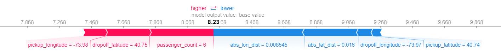
    
    Let's take one example of one-passenger ride and one example of six-passenger-ride. As we saw from partial dependence plots, we can see that for one-passenger ride the number of passengers have minimal importance. However, in six-passenger ride, the number of passengers had the highest positive impact. Like this, **a feature that has low impact in the overall prediction power might have high impact in individual prediction point**.

    We observed that latitude distance had more impact on overall predictions in the section above. While in the first example the latitude distance have more impact on the prediction, in the second example the longitude distance had more impact, unlike in the analysis for overall prediction power. **Feature importances and impacts on each individual prediction do not necessarily reflect what the features do to the overall prediction**.

    Due to these reasons, analyzing individual predictions may also be important depending on the purpose of the model. For example, the insights from this section can be valuable to companies in mobility industry that provide personalized services to each customer.
    
      + SHAP Summary Plots give us a birds-eye view of feature importance and what is driving it. Each dot has the following characteristics:
        + Vertical location shows what feature it is depicting
        + Color shows whether that feature was high or low for that row of the dataset
        + Horizontal location shows whether the effect of that value caused a higher or lower prediction.
      
      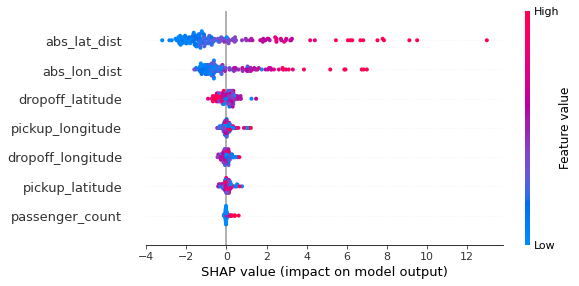
      
      Here, the longitude/latitude distance features are the most widely spread. In these features, points with low feature values have low SHAP values, while points with high feature values have high SHAP values. The width of the effects range is not a reasonable approximation to permutation importance. For that matter, the width of the range doesn't map well to any intuitive sense of "importance" because it can be determined by just a few outliers. However if all dots on the graph are widely spread from each other, that is a reasonable indication that permutation importance is high. Because the range of effects is so sensitive to outliers, permutation importance is a better measure of what's generally important to the model.

      While in some features we can see reasonably clear separation between the blue and pink dots, in other variables dots are jumbled together. This suggests that sometimes increasing that feature leads to higher predictions, and other times it leads to a lower prediction. The most likely explanation for this effects is that the variable has an interaction effect with other variables.
      
    + SHAP Dependence Contribution Plots: using SHAP Dependence Contribution Plots, we can not only observe the relationship between SHAP value for a feature and the feature but also interactions a feature has with other features.
    
    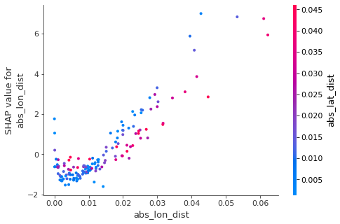 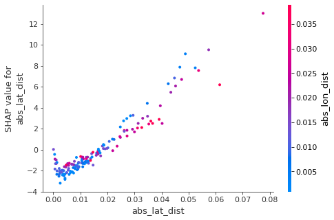
    
    The graphs slope upward, meaning the larger the distance, the higher the model's prediction for fare is. The graphs also suggest feature interactions. We can see from the first graph that when the longitude distance is small, SHAP value for longitude distance does not show much difference whether the latitude distance is large/small. However, when the longitude distance is large, there is a slight tendency of fare predictions being larger when latitude distance is smaller. Similar tendency shows in the second graph as well, although it is less obvious than in the first graph.

+ **Contributions**:
  + Used techniques like permutation importance, partial dependence plots, and SHAP values to extract human-understandable insights from models, such as feature importance and how each feature affects predictions, both in big-picture sense and for particular prediction points.
  + Generated new features based on the insights in order to make improvements to the baseline model.
  + The focus of this project is on Machine Learning explainability. Thus the model itself has not been optimized/tuned for the purpose of this project. See other projects for more on model building and tuning.
  
+ **Keywords: Machine Learning Explainability, Permutation Importance, Partial Dependence, SHAP Values, Python**


Following [suggestions](http://nicercode.github.io/blog/2013-04-05-projects/) by [RICH FITZJOHN](http://nicercode.github.io/about/#Team) (@richfitz). This folder is orgarnized as follows.

```
proj/
├── data/ data used in the analysis. 
├── doc/ report and/or final deliverables.
└── figs/ figures.
```

Please see each subfolder for a README file.
