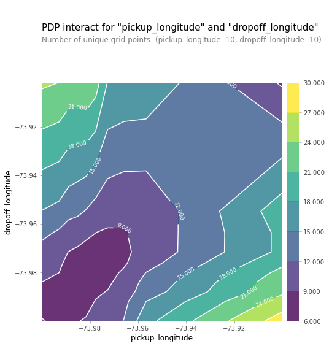
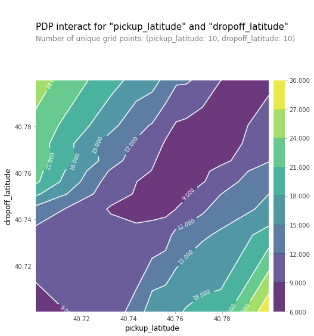
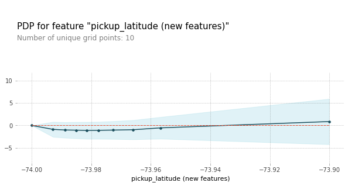

# NYC Taxi Fare Prediction--Machine Learning Explainability

+ This project was conducted by Young Sim.

+ **Keywords: Machine Learning Explainability, Data Visualization, Permutation Importance, Partial Dependence, SHAP Values, Python**

+ **Objectives**: The goal of this porject is to extract human-understandable insights from machine learning models by using techniques like permutation importance, partial dependence plots, and SHAP values. The following insights can be driven by using these methods:

    + What features in the were most important in the corresponding model?
    + How does each feature affect predictions in a big-picture sense?
    + For any single prediction from a model, how did each feature affect that particular prediction?
    
    These insights not only help human understanding of machine learning models but also help find directions for model improvements.

+ **Summary**: In this project, we will focus on model explainability techniques rather than building and optimizing the model. So here we just used a simple random forest model to keep it easy. See project notebook for more details.

    + **Permutation Importance**: randomly re-ordering a single column should cause less accurate predictions, since the resulting data no longer corresponds to anything observed in the real world. Permutation importance gives us **what features have the biggest impact on predictions**, or **feature importance**.
    
      

      In the example above, we can tell while pick up locations and drop off locations are all important features, passenger count does not have much importance in the model. Also, it seems that latitude have more importance than longitude.

    + **Partial Dependence Plots**: show how a feature affects predictions. Partial dependence plots repeatedly alter the value for one variable to make a series of predictions and trace out predicted outcomes.
        
         
        
        We have a sense from the permutation importance results that **distance is the most important determinant of taxi fare**. The model didn't include distance measures as features, so coordinate features capture the effect of distance. Being picked up near the center of the longitude values lowers predicted fares on average, because it means shorter trips (on average). For the same reason, we see the general U-shape in all our partial dependence plots for latitude/longitude.
        
        
        
        We can also observe that the **number of passengers is positively related to the fare**. In the results from permutation importance, we saw that the number of passengers have very low feature importance; positive relationship between a feature and target does not necessarily indicate high permutation importance.
        
        
          
        
        In **2D partial dependent plots**, diagonal contours are expected to be seen because these are pairs of values where the pickup and dropoff longitudes/latitudes are nearby, indicating shorter trips. While we can see that trend in the above plots, we can also see that prices increase as you go further to the upper-right of the longitude graph, and as you go to the lower-left of the latitude graph. This could be worth further investigation, though the effect is small compared to moving away from the central diagonal line.

    + **New Features**: new features are created based on the results and insights above. The new features are **longitude/latitude distances**. Since we only have seven features includeing the new features here, we'll keep all features. When there are too many features and the computational expense is high or when we are working with models that are more likely to overfit, we can use the above technique and insights for feature selection.
    
        
    
        While both features for distances had higher feature importances than location features, latitude distances are more important than longitude distances. This does not give us information on whether traveling a fixed latitudinal distance is more or less expensive than traveling the same longitudinal distance.
      
    + **Changes in Partial Dependence Plots**
    
         
    
         
    
        From the graphs above, we can see that the slope of the partial dependence plot became much gradual. Once you control for absolute distance traveled, the pickup_longitude has only a very small impact on predictions.

    + **PDP for New Features**: The relationships are both positive. We can also see that the slope is steeper for latitude distance, which indicates it costs more to travel a fixed latitudinal distance than traveling the same longitudinal distance.
    
     
    
    + **SHAP Values**: An estimate of the impact of a given feature on the prediction. It interprets the impact of having certain value for a given feature in comparison to the prediction we'd make if that feature took some baseline value.

        SHAP values are generated by the following process:
        + Takes a single row with passenger data (of the same format you as raw data).
        + Creates a visualization showing what features of that passenger increased/decreased the fare and how much those features mattered.
    
          
    
        Let's take one example of one-passenger ride and one example of six-passenger-ride. Feature importances and impacts on each individual prediction do not necessarily reflect what the features do to the overall prediction. Due to these reasons, analyzing individual predictions may also be important depending on the purpose of the model. For example, the insights from this section can be valuable to companies in mobility industry that provide personalized services to each customer.
    
  + **SHAP Summary Plots** give us a birds-eye view of feature importance and what is driving it. Each dot has the following characteristics:
    + Vertical location shows what feature it is depicting
    + Color shows whether that feature was high or low for that row of the dataset
    + Horizontal location shows whether the effect of that value caused a higher or lower prediction.

       
      
   + **SHAP Dependence Contribution Plots**: using SHAP Dependence Contribution Plots, we can not only observe the relationship between SHAP value for a feature and the feature but also interactions a feature has with other features.
    
         
    
        The graphs slope upward, meaning the larger the distance, the higher the model's prediction for fare is. The graphs also suggest feature interactions. We can see from the first graph that when the longitude distance is small, SHAP value for longitude distance does not show much difference whether the latitude distance is large/small. However, when the longitude distance is large, there is a slight tendency of fare predictions being larger when latitude distance is smaller.

+ **Contributions**:
  + Used techniques like permutation importance, partial dependence plots, and SHAP values to extract human-understandable insights from models, such as feature importance and how each feature affects predictions, both in big-picture sense and for particular prediction points.
  + Generated new features based on the insights in order to make improvements to the baseline model.
  + The focus of this project is on Machine Learning explainability. Thus the model itself has not been optimized/tuned for the purpose of this project. See other projects for more on model building and tuning.


Following [suggestions](http://nicercode.github.io/blog/2013-04-05-projects/) by [RICH FITZJOHN](http://nicercode.github.io/about/#Team) (@richfitz). This folder is orgarnized as follows.

```
proj/
├── data/ data used in the analysis. 
├── doc/ report and/or final deliverables.
└── figs/ figures.
```

Please see each subfolder for a README file.
